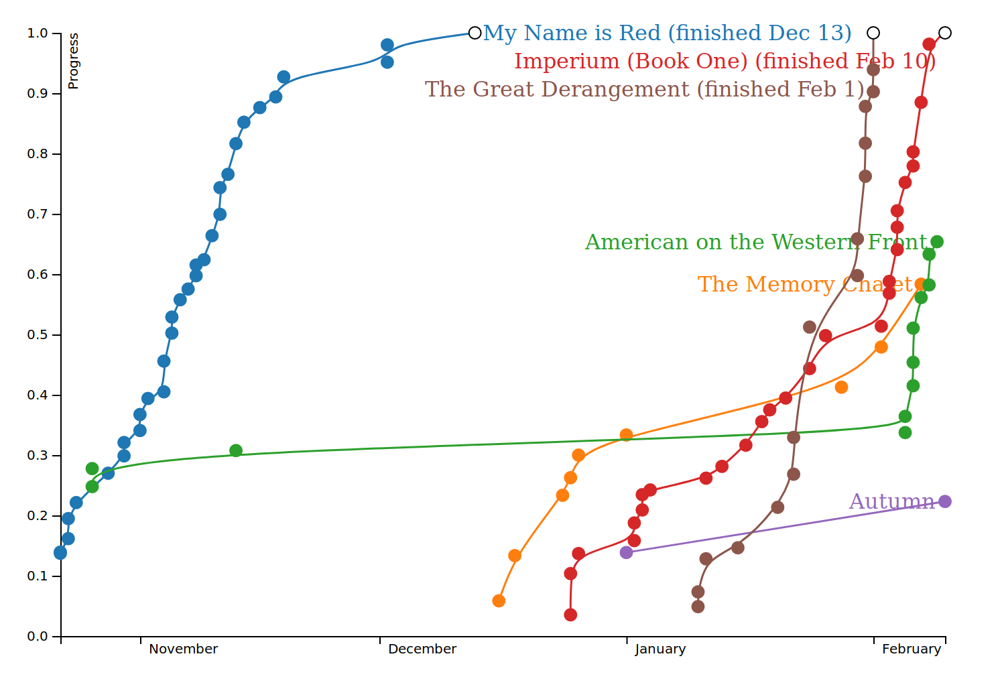

# readtracker-d3
D3 chart of data exported from readtracker app 

This D3 project produces a chart of your reading, based on tracking data that you export from Christoffer Klang's [readtracker app](https://play.google.com/store/apps/details?id=com.readtracker&hl=en). 
The D3 code is based on [https://bl.ocks.org/mbostock/3884955](https://bl.ocks.org/mbostock/3884955).

[Demo](https://rawgit.com/pbinkley/readtracker-d3/master/index.html). To use it, first export your readtracker data and move it to your local file system, so that you can provide it to the demo script. It will not be uploaded to any server, just read by the javascript in your browser.
